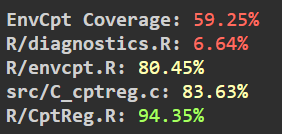

# GSoC 2026 - Generalized Changepoint Regression

Test submissions for the [Generalized Changepoint Regression](https://github.com/rstats-gsoc/gsoc2026/wiki/Generalized-changepoint-regression) project mentored by Rebecca Killick and Colin Gallagher.

---

## Easy Test

> Load `changepoint` and `EnvCpt`, create a time series with changing AR structure, run only the AR1 and AR2 algorithms using non-exported functions, and plot the results.

Created a 600-observation time series across three segments with genuinely different AR structure - AR(1) with φ=0.8, AR(1) with φ=−0.6, and AR(2) with φ₁=0.5, φ₂=0.3. Both detectors found the true changepoints at 200 and 400 within 1–2 observations.

The key insight was understanding the exact matrix format `EnvCpt:::cpt.reg` expects:
```r
# AR(1)
EnvCpt:::cpt.reg(cbind(data[-1], rep(1, n-1), data[-n]), method = "PELT")

# AR(2)
EnvCpt:::cpt.reg(cbind(data[-c(1:2)], rep(1, n-2), data[2:(n-1)], data[1:(n-2)]), method = "PELT")
```

**Code and plot:** [`easy/`](./easy)

---

## Medium Test

> Fork `changepoint` or `EnvCpt` and write new tests to increase code coverage. Commit back to the main repository.

Forked `rkillick/EnvCpt` and wrote 71 new tests targeting the previously untested internal functions - `cpt.reg`, `check_data`, `ChangepointRegression`, `CptReg_AMOC_Normal`, and `CptReg_PELT_Normal` - along with subset model coverage for `envcpt` and edge cases for `AICweights` and `BIC`.

| File | Before | After |
|------|--------|-------|
| `R/CptReg.R` | 0.00% | 94.35% |
| `R/envcpt.R` | 0.00% | 80.45% |
| `src/C_cptreg.c` | 1.77% | 83.63% |
| **Overall** | **0.97%** | **59.25%** |



**Pull Request:** [rkillick/EnvCpt #PR](https://github.com/rkillick/EnvCpt/pull/18)

---

## Hard Test

> Wrap the easy task into an R function with argument checks. Build a package with tests, GitHub Actions, and code coverage via `covr`.

Built `cptAR` - a standalone R package that turns the manual lag-matrix construction from the Easy test into a clean one-line interface, with support for AR(1)/AR(2) and optional linear trend.
```r
devtools::install_github("Delta17920/cptAR")

# AR(1) with trend
cptAR(x, order = 1, trend = TRUE)

# AR(2) without trend  
cptAR(x, order = 2, trend = FALSE)
```

- 11 unit tests, 0 failures
- GitHub Actions: R CMD check + Codecov coverage on every push
- Input validation catches bad data types, NAs, invalid order, short series

**Package repository:** [Delta17920/cptAR](https://github.com/Delta17920/cptAR)

---

## About

**Contributor:** Pratik Bangerwa - [@Delta17920](https://github.com/Delta17920)  
**Mentors:** Rebecca Killick, Colin Gallagher
